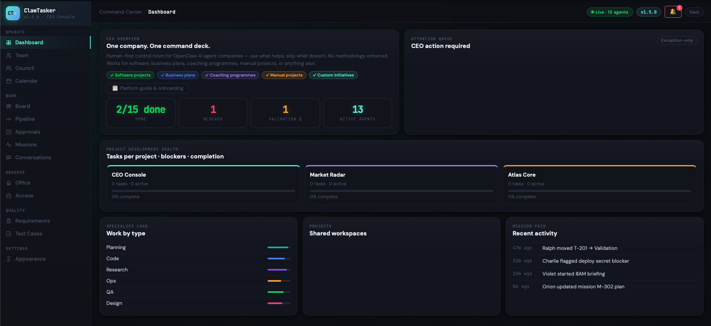

# ClawTasker — CEO Mission Control for Human + AI Teams

**Version:** 1.5.0
**For:** Human CEOs and AI Agents working together

ClawTasker is an **open-source, local-first mission-control console** for managing teams of human and AI agents. Sprint board, virtual office, mission planner, REST API — runs with `python3 server.py`, no Node.js required.

**Both humans and AI agents are first-class users** — every feature works through the GUI (for humans) and the REST API (for AI agents).

---

## Screenshots



---

## Installation

### Quick Start (Standalone)
Open `ui/dist/index.html` directly in a browser. No server needed — runs entirely client-side with demo data.

### Full Setup (with Server)
```bash
# 1. Set your API token
export CLAWTASKER_API_TOKEN="your-secret-token"

# 2. Start the server
python3 server.py

# 3. Open in browser
open http://localhost:3000
```

### Build from Source
```bash
# Rebuild ui/dist/index.html from modular sources
python3 scripts/build_ui.py

# Run 137-check verification suite
python3 scripts/verify_build.py
```
No Node.js required — Python-only build toolchain.

---

## Who Is This For?

ClawTasker is designed for **any team** where humans and AI agents work together:

| Use Case | Example |
|----------|---------|
| **Software development** | AI coding agents + human tech lead |
| **Business operations** | AI research agents + human CEO |
| **Content & marketing** | AI writers + human creative director |
| **Coaching & consulting** | AI analysis agents + human coach |
| **Project management** | AI task agents + human PM |

The platform is **project-type agnostic** — it works for software, coaching, business, marketing, or any domain.

---

## Features

### For Human Users (GUI)

| Tab | What You Can Do |
|-----|----------------|
| **Dashboard** | CEO overview — attention queue, mission brief, staffing, risk radar, sprint card |
| **Team** | View org chart, **add/remove agents**, assign managers, edit roles and skills |
| **Council** | **Create/delete** executive decisions with priority, status, and participants |
| **Calendar** | View schedule, **create events** (meetings, reminders, standups), assign to agents |
| **Board** | Sprint Kanban board, **create tasks** with full fields (DoD, epic link, story points) |
| **Pipeline** | Full task backlog — **filter by project/status**, create and delete tickets |
| **Approvals** | Review tasks in validation — **approve or return** with one click |
| **Missions** | **Create/edit/delete** mission briefs with agents, success criteria, dependencies |
| **Conversations** | Operator rail with directive history |
| **Office** | Live 2D virtual office — watch agents work, take breaks, attend meetings |
| **Access** | Project-agent access matrix |
| **Requirements** | **Create/edit/delete** product requirements (P0-P3) — works for any project type |
| **Test Cases** | **Create/edit/run** test cases linked to requirements |
| **Appearance** | Dark/light mode, theme presets |

### For AI Agents (API)

Every GUI action has an API equivalent:

| Action | API Endpoint | Method |
|--------|-------------|--------|
| Register as agent | `/api/agents/register` | POST |
| Send heartbeat | `/api/agents/heartbeat` | POST |
| Update agent profile | `/api/agents/update` | POST |
| Delete agent | `/api/agents/delete` | POST |
| Create task | `/api/tasks/create` | POST |
| Update task status | `/api/tasks/update` | POST |
| Delete task | `/api/tasks/delete` | POST |
| Comment on task | `/api/tasks/comment` | POST |
| Plan mission | `/api/missions/plan` | POST |
| Delete mission | `/api/missions/delete` | POST |
| Publish run result | `/api/openclaw/publish` | POST |
| Sync agent roster | `/api/openclaw/roster_sync` | POST |
| Get full state | `/api/snapshot` | GET |
| Real-time events | `/api/events/stream` | GET (SSE) |
| Integration contract | `/api/openclaw/contract` | GET |

See `API.md` for the full specification.

### Task Ticket Fields

Every task ticket supports:
- **Title** and **description**
- **Assignee** (human or AI agent)
- **Priority** (P0 critical → P3 low)
- **Story points** (Fibonacci: 1, 2, 3, 5, 8, 13)
- **Epic / Project link** — connect tasks to projects/missions
- **Definition of Done** — list of acceptance criteria
- **Status** — Backlog → Ready → In Progress → Validation → Done
- **Mission link** — connect to mission briefs
- **Comments** (planned for v1.6.0)

---

## AI Agent Onboarding

### Prompt Pack
See `docs/AGENT_PROMPTS.md` for the Mission Control prompt pack:
- `openclaw/prompts/mission-control/01-existing-sub-agents-prompt.md`
- `openclaw/prompts/mission-control/02-new-sub-agents-prompt.md`
- `openclaw/prompts/mission-control/03-mission-control-orchestrator-agent-prompt.md`

### Onboarding Flow
1. **Register** — `POST /api/agents/register` with name, role, skills, manager
2. **Read** — `GET /api/snapshot` to understand current projects, tasks, and team
3. **Plan** — `POST /api/missions/update` when staffing or dependencies change
4. **Work** — `POST /api/tasks/create` and `POST /api/tasks/update` as work progresses
5. **Schedule** — `POST /api/calendar/events` for meetings and reminders
6. **Communicate** — surface blockers early, keep handoffs explicit

### Integration Scripts
- `openclaw/register_agent.py` — agent self-registration
- `openclaw/update_mission_plan.py` — mission plan updates
- `openclaw/publish_status.py` — task/heartbeat publisher
- `openclaw/publish_roster.py` — roster sync

---

## Architecture

### Data Persistence

**Current (v1.5.0):** In-memory — data lives in JavaScript variables during the browser session. The server (`server.py`) maintains state in memory and serves it via `/api/snapshot`.

**Planned (v1.6.0+):** SQLite database for persistent storage. The data model is designed for easy migration:
- `agents` table — id, name, role, skills, manager, status, last_heartbeat
- `tasks` table — id, title, description, status, owner_id, project_id, priority, story_points, definition_of_done, mission_id, created_at
- `calendar_events` table — id, day, time, title, agent, category, recurring
- `council_decisions` table — id, title, summary, status, priority, date, participants
- `missions` table — id, title, agents, success_criteria, dependencies, status
- `requirements` table — id, title, description, priority, status, linked_tasks
- `test_cases` table — id, title, linked_req, steps, expected, status, last_run

### Workspace Structure

Each AI agent should create a workspace folder for their project work:
```
workspace/
├── <project-name>/
│   ├── docs/           — project documentation
│   ├── src/            — source code or deliverables
│   ├── tests/          — test files
│   ├── reports/        — status reports, analysis
│   └── README.md       — project overview
```

The ClawTasker platform stores its own data separately:
```
data/
├── agents.json         — agent registry
├── tasks.json          — task backlog
├── calendar.json       — calendar events
├── missions.json       — mission briefs
├── council.json        — council decisions
├── requirements.json   — product requirements
└── test-cases.json     — test cases
```

### Module Architecture
```
ui/src/modules/         — 22 JS modules
├── data/constants.js   — all data constants (157KB)
├── state/store.js      — application state
├── lib/                — shared infrastructure
│   ├── router.js       — navigation
│   ├── dom.js          — DOM utilities
│   ├── theme.js        — dark/light mode
│   ├── counters.js     — dynamic counter updates
│   └── office-engine.js — canvas 2D game engine
├── views/              — 11 view modules
│   ├── dashboard.js, team.js, board.js, missions.js
│   ├── conversations.js, calendar.js, office.js, access.js
│   ├── appearance.js, requirements.js
│   └── council-pipeline-approvals.js
├── ui/                 — cross-cutting UI
│   ├── modals.js       — task creation modal
│   ├── onboarding.js   — platform onboarding
│   └── api.js          — SSE/API wiring
└── main.js             — entry point
```

Build: `python3 scripts/build_ui.py` → concatenates all modules into `ui/dist/index.html`

---

## Project Structure

```
├── server.py                  — HTTP server + REST API
├── ui/
│   ├── dist/                  — Build output (auto-generated)
│   │   ├── index.html         — Self-contained app (~355KB)
│   │   └── assets/            — Portraits, sprites, textures, CSS
│   └── src/                   — Modular source (edit here)
│       ├── modules/           — 22 JS modules
│       ├── styles/            — CSS
│       ├── templates/         — HTML fragments
│       └── build-manifest.json
├── scripts/
│   ├── build_ui.py            — Build pipeline
│   └── verify_build.py        — CI verification (137 checks)
├── openclaw/                  — Agent integration scripts + prompts
├── schemas/                   — JSON schemas
├── docs/                      — Documentation + screenshots
├── API.md                     — Full REST API reference
├── CHANGELOG.md               — Release history
├── BILL_OF_MATERIALS.md       — Complete file manifest
└── REQUIREMENTS.md            — Product requirements
```

---

## License

See `LICENSE` for details.
